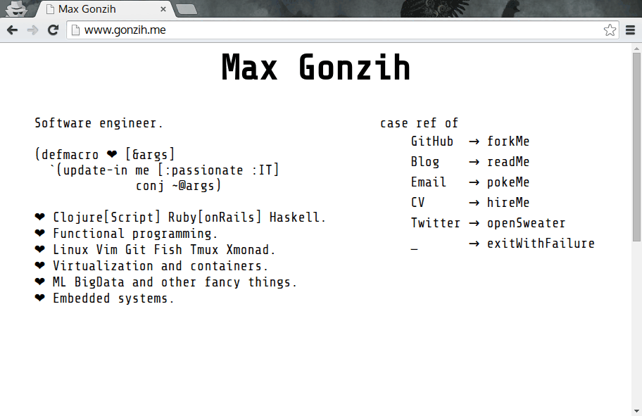

# cljs-~-editor

Add clojurescript to every page Quake style



## Usage

Execute following script in js console:

```javascript
(function() {var el = document.createElement('script'); el.type = 'text/javascript'; el.src = 'http://blog.gonzih.me/cljs-tilda-editor/cljs-repl.js'; document.body.appendChild(el); }())
````

Press ` to hide/expand editor.

## Development

To get an interactive development environment run:

    lein figwheel

and open your browser at [localhost:3449](http://localhost:3449/).
This will auto compile and send all changes to the browser without the
need to reload. After the compilation process is complete, you will
get a Browser Connected REPL. An easy way to try it is:

    (js/alert "Am I connected?")

and you should see an alert in the browser window.

To clean all compiled files:

    lein clean

To create a production build run:

    lein cljsbuild once min

And open your browser in `resources/public/index.html`. You will not
get live reloading, nor a REPL. 

## License

Copyright © 2015 Max Gonzih <gonzih at gmail dot com>

Distributed under the Eclipse Public License either version 1.0 or (at your option) any later version.
